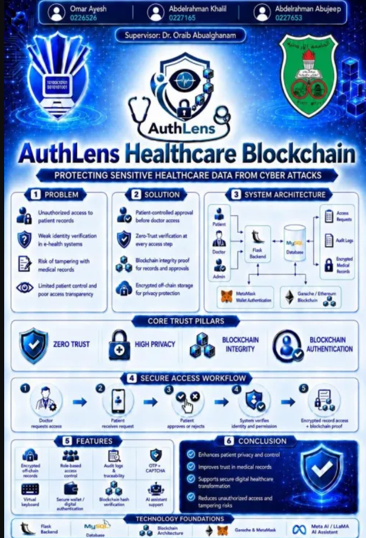
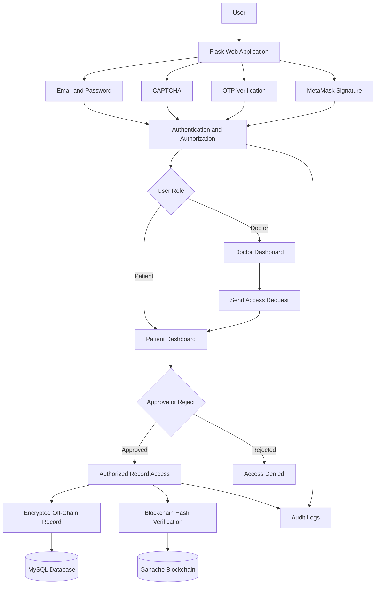

# AuthLens Healthcare Blockchain

<p align="center">
  <strong>A Zero Trust, privacy-preserving healthcare authentication and medical-record integrity system powered by blockchain technology.</strong>
</p>

<p align="center">
  Graduation Project — The University of Jordan
</p>

---



## Overview

**AuthLens** is a healthcare security system designed to protect sensitive medical information by combining:

- Blockchain-based integrity verification
- Zero Trust security principles
- Privacy-preserving identity handling
- Multi-layer authentication
- Patient-controlled medical-record access

The system allows patients and doctors to authenticate through multiple security layers while ensuring that doctors can access patient records only after receiving explicit approval from the patient.

Sensitive medical information is stored off-chain, while cryptographic hashes are recorded on the blockchain. This provides tamper detection without exposing complete medical records publicly.
---
## Project Impact

AuthLens has progressed beyond its academic development stage and is currently being considered for potential implementation at the **University of Jordan Hospital**. This represents a proud milestone for the team and demonstrates the project's potential to contribute to secure, privacy-preserving healthcare systems in real-world environments.
---

## Project Objectives

AuthLens was developed to:

- Strengthen authentication within healthcare systems
- Reduce unauthorized access to medical records
- Give patients control over doctor access requests
- Verify doctor identities before granting access
- Protect medical-record integrity using blockchain
- Minimize exposure of real user identities
- Maintain audit logs for important security events
- Apply Zero Trust principles to every sensitive request

---

## Main Features

### Multi-Layer Authentication

AuthLens provides several authentication mechanisms:

- Email and password authentication
- Image CAPTCHA verification
- Email-based one-time passwords
- MetaMask wallet-signature authentication
- Nonce-based signature verification
- Session-based authentication
- Role-based access control

### Patient-Controlled Access

Doctors do not automatically receive access to patient records.

The access process follows this workflow:

1. A doctor submits an access request.
2. The patient receives and reviews the request.
3. The patient approves or rejects it.
4. The system verifies the request status.
5. The doctor receives access only when approval exists.
6. The event is recorded in the system audit logs.

### Doctor Identity Verification

Doctor accounts require additional verification before receiving full privileges.

The verification process can include:

- Identity-card upload
- Medical-identification upload
- Medical-identification number
- Account approval status

### Blockchain Integrity

AuthLens uses blockchain technology to detect unauthorized changes to medical records.

The system:

1. Processes the medical record.
2. Encrypts and stores sensitive data off-chain.
3. Generates a cryptographic hash of the record.
4. Stores the hash on the blockchain.
5. Saves the blockchain transaction hash.
6. Compares hashes when integrity verification is required.

### Privacy-Preserving Design

The system minimizes unnecessary identity exposure by using hashed identifiers where appropriate.

Complete medical records and sensitive identity information are not stored directly on the blockchain.

### Audit Logging

Important activities can be recorded, including:

- Login attempts
- OTP verification
- Access requests
- Access approvals and rejections
- Medical-record operations
- Blockchain transactions
- Unauthorized-access attempts

---

## Core Security Principles

### Zero Trust

No user or request is automatically trusted.

Authentication, role, approval status, and authorization are checked before sensitive actions are allowed.

### Blockchain Integrity

Medical-record hashes stored on the blockchain provide tamper-evident integrity verification.

### High Privacy

Sensitive healthcare information remains off-chain, while only integrity-related values are recorded on the blockchain.

### Patient Ownership and Control

Patients decide which doctors are allowed to access their medical information.

---

## System Roles

### Patient

A patient can:

- Create and access an account
- Complete CAPTCHA and OTP verification
- Use wallet-signature authentication
- View personal medical records
- Receive doctor access requests
- Approve or reject access requests
- Monitor authorized access

### Doctor

A doctor can:

- Register a doctor account
- Submit identity-verification information
- Wait for account approval
- Request access to patient records
- View records after patient approval

### Administrator

The administrative workflow supports:

- Reviewing doctor-verification submissions
- Approving or rejecting doctor accounts
- Monitoring system activities
- Reviewing security and audit information

---

## System Architecture



---

## Medical-Record Protection Model

```text
Medical Record
      |
      +----> Encryption ----> MySQL Off-Chain Storage
      |
      +----> Hashing -------> Blockchain Storage
                                  |
                                  v
                         Transaction Hash Saved
```

Only the cryptographic hash is stored on the blockchain. The complete sensitive medical record remains off-chain.

---

## Technologies Used

### Backend

- Python
- Flask
- Werkzeug
- Flask-Mail

### Database

- MySQL
- MySQL Workbench
- MySQL Connector/Python

### Blockchain

- Solidity
- Ganache
- MetaMask
- Web3.py
- Ethereum account-signature verification
- Truffle

### Security and Cryptography

- Password hashing
- Image CAPTCHA
- One-time passwords
- Data encryption
- Cryptographic hashing
- Wallet signatures
- Nonce-based replay protection
- Role-based authorization
- Audit logging

### Frontend

- HTML
- CSS
- JavaScript
- Flask/Jinja templates

### Development Tools

- Visual Studio Code
- Remix IDE
- MySQL Workbench
- Git
- GitHub

---

## Repository Structure

```text
AuthLens-Healthcare-Blockchain/
│
├── Database/
│   └── MySQL database scripts
│
├── Documentation/
│   └── Graduation project report and documentation
│
├── Presentation-Slides/
│   └── Graduation project presentation
│
├── blockchain/
│   └── Blockchain-related files
│
├── contracts/
│   └── Solidity smart contracts
│
├── scripts/
│   └── Project and deployment scripts
│
├── static/
│   ├── CSS files
│   ├── JavaScript files
│   ├── Images
│   └── Application resources
│
├── templates/
│   └── Flask HTML templates
│
├── truffle-ledger/
│   └── Truffle blockchain project
│
├── .gitignore
├── Poster.png
├── app.py
├── blockchain.py
├── blockchain_config.py
├── requirements.txt
└── README.md
```

---

## Important Application Pages

The project includes interfaces for:

- Home page
- Login
- Registration
- OTP verification
- Wallet authentication
- Doctor verification
- Patient dashboard
- Doctor dashboard
- Medical-record management
- Doctor access requests
- Patient approval and rejection

---

## Database Design

AuthLens uses MySQL to store application data.

The primary database used during development was:

```text
ehealth_auth
```

Important database tables can include:

### Users

Stores information such as:

- User identifier
- Hashed identifier
- Email address
- Password hash
- User role
- Wallet address
- Doctor approval status
- Login nonce

### Medical Records

Stores information such as:

- Record owner
- Encrypted medical data
- Medical-record hash
- Blockchain transaction hash

### Access Requests

Stores:

- Doctor identifier
- Patient identifier
- Request status
- Approval or rejection result

### OTP Codes

Stores temporary verification information such as:

- Email address
- OTP code
- Expiration time

### Audit Logs

Stores security and activity information such as:

- Event type
- Associated user
- IP address
- Date and time

The database creation scripts are available in the [`Database`](Database/) folder.

---

## Installation

### 1. Clone the Repository

```bash
git clone YOUR_REPOSITORY_URL
```

Enter the project directory:

```bash
cd AuthLens-Healthcare-Blockchain
```

### 2. Create a Virtual Environment

```bash
python -m venv venv
```

Activate it on Windows:

```bash
venv\Scripts\activate
```

Activate it on Linux or macOS:

```bash
source venv/bin/activate
```

### 3. Install Python Dependencies

```bash
pip install -r requirements.txt
```

The main dependencies include:

```text
Flask
mysql-connector-python
Flask-Mail
Werkzeug
web3
eth-account
Pillow
pycryptodome
```

---

## Database Setup

1. Open MySQL Workbench.
2. Connect to the local MySQL server.
3. Open the SQL script inside the [`Database`](Database/) folder.
4. Execute the database script.
5. Confirm that the database and required tables were created.
6. Verify the database configuration used by the Flask application.

Example configuration:

```python
DB_HOST = "localhost"
DB_USER = "your_mysql_username"
DB_PASSWORD = "your_mysql_password"
DB_NAME = "ehealth_auth"
```

---

## Blockchain Setup

AuthLens uses Ganache as a local Ethereum blockchain environment.

1. Start Ganache.
2. Create or open a Ganache workspace.
3. Confirm the RPC server address.

A commonly used Ganache RPC address is:

```text
http://127.0.0.1:7545
```

4. Compile the Solidity contract using Remix or Truffle.
5. Deploy the contract to Ganache.
6. Copy the deployed contract address.
7. Update the address and blockchain settings inside:

```text
blockchain_config.py
```

8. Confirm that the contract ABI matches the deployed contract.
9. Ensure that Ganache is running before blockchain operations are performed.

A new deployment may produce a different contract address.

---

## MetaMask Setup

1. Install the MetaMask browser extension.
2. Add the Ganache local network.
3. Import a Ganache test account.
4. Open the AuthLens application.
5. Connect MetaMask.
6. Approve the requested wallet-signature operation.

The application verifies wallet ownership using a signed nonce. The private key is not sent to the Flask application.

---

## Email and OTP Setup

AuthLens uses Flask-Mail to send one-time passwords.

Configure the mail settings used by the application.

Example:

```python
MAIL_SERVER = "smtp.gmail.com"
MAIL_PORT = 587
MAIL_USE_TLS = True
MAIL_USERNAME = "your_email@example.com"
MAIL_PASSWORD = "your_email_app_password"
```

An application-specific password may be required when Gmail is used.

---

## Running the Application

After configuring MySQL, Ganache, the deployed smart contract, and email settings, run:

```bash
python app.py
```

The application is commonly available at:

```text
http://127.0.0.1:5000
```

---

## Main Security Controls

AuthLens implements multiple defensive controls:

- Password hashing
- CAPTCHA protection
- OTP verification
- Session management
- Role-based access control
- Doctor identity verification
- Patient-controlled authorization
- Wallet-signature authentication
- Nonce-based replay protection
- Medical-data encryption
- Blockchain integrity verification
- Separation of on-chain and off-chain data
- Security audit logging

---

## Testing Areas

The system was evaluated across several functional and security areas:

- User registration
- Patient and doctor login
- CAPTCHA verification
- OTP generation and expiration
- Role separation
- Doctor identity verification
- Access-request creation
- Patient approval and rejection
- Unauthorized-access prevention
- Medical-record operations
- Blockchain transaction generation
- Record-integrity verification
- MetaMask wallet authentication
- Audit-log generation
- User-interface usability

---

## Future Improvements

Potential future improvements include:

- Emergency access through a trusted delegate
- Risk-based authentication
- AI-based suspicious-activity detection
- QR-based medical identity
- Wearable-device integration
- Cloud deployment and improved scalability
- Improved blockchain-network handling
- Production-grade key management
- Real-time security alerts
- Advanced administrative controls

---

## Project Documentation

- [Graduation Project Poster](Poster.png)
- [Full Project Documentation](Documentation/)
- [Presentation Slides](Presentation-Slides/)
- [Database Scripts](Database/)
- [Solidity Contracts](contracts/)
- [Truffle Blockchain Project](truffle-ledger/)

---

## Project Team

- **Omar Ayesh**
- **Abdelrahman Khalil**
- **Abdelrahman Abujee'p**

---

## Supervisor

**Dr. Oraib Abualghanam**

---

## University

**The University of Jordan**  
**King Abdullah II School of Information Technology**  
**Cybersecurity Program**

---

## Academic Disclaimer

AuthLens was developed as a university graduation project for academic, educational, research, and demonstration purposes.

It is not a production-ready healthcare platform and should not be used to store real patient information without additional security engineering, infrastructure hardening, regulatory review, professional penetration testing, smart-contract auditing, and legal compliance assessment.

All accounts, documents, medical information, wallet accounts, and blockchain transactions used for demonstration purposes should contain fictional or test data.

---

<p align="center">
  <strong>AuthLens Healthcare Blockchain</strong>
</p>

<p align="center">
  Protecting sensitive healthcare data through Zero Trust, patient control, privacy-preserving authentication, and blockchain integrity.
</p>
